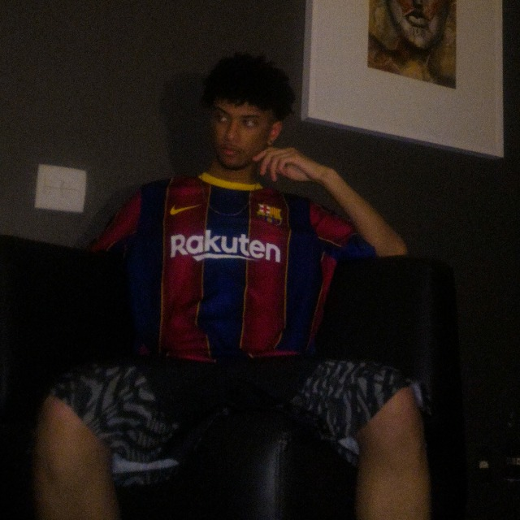

# MAGNA

Este é um projeto em grupo para avaliar o conhecimento do seus participantes durante o segundo semestre do curso de Análise e Desenvolvimento de Sistemas na Faculdade SPTech, esse projeto agrega em conteúdos técnicos quanto em conhecimentos de négocio, todo o conteúdo é implementado utilizando metodologia ágil, tendo tarefas separadas por sprints.

# CONTEXTO

Magna é um projeto que busca ajudar os estabelecimentos que utilizam de totens de autoatendimento, alertando sobre gargalos, estado atual e utilização de componentes.

# Configuração

Estrutura
- HTML e CSS
- JavaScript
- Java
   
# Colaboradores
___

